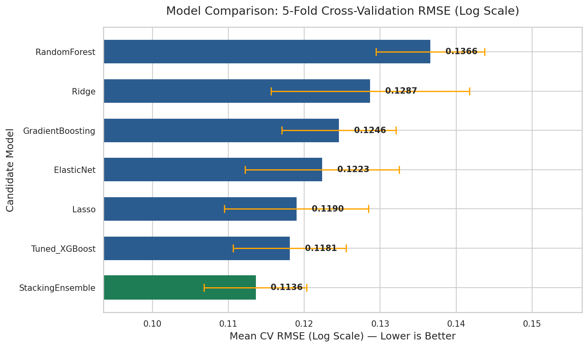
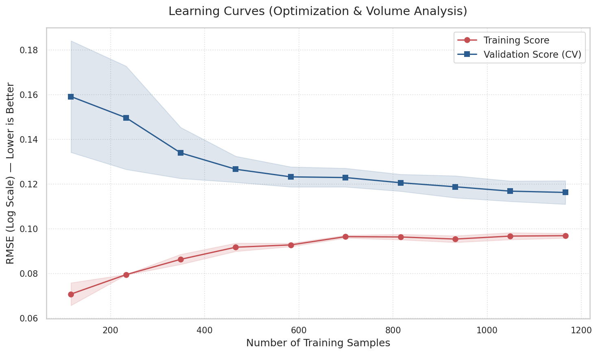
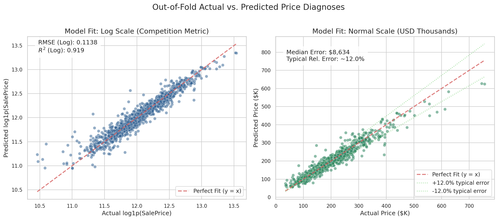

# 🏡 Ames Iowa House Price Prediction: Advanced Pricing Intelligence

[](https://colab.research.google.com/github/Skullo-bot/ames-housing-advanced-regression/blob/main/house_prices_advanced_regression.ipynb)
[](https://www.kaggle.com/competitions/house-prices-advanced-regression)
[](https://www.python.org/)

An enterprise-grade, end-to-end Machine Learning pipeline designed to predict residential home prices in Ames, Iowa. This project leverages advanced feature engineering, structural missing value imputation, and a robust **Stacking Ensemble Regressor** to minimize Log-RMSE.

---

## 📊 Model Performance & Diagnostics

The final predictive architecture utilizes a layered **Stacking Ensemble** combining regularized linear models and state-of-the-art gradient boosting frameworks.

### Model Comparison
Below is the evaluation of individual base estimators versus our meta-regressor:

<p align="center">
  
</p>

### Learning Curves & Diagnostics
To ensure the model generalizes perfectly without overfitting, training performance was strictly monitored using 5-Fold Cross-Validation:

<p align="center">
  
  
</p>

---

## 🛠️ Core Pipeline Architecture

### 1. Advanced Preprocessing & Imputation
* **Structural NA Handling:** Intelligently mapped missing strings (NaN) to categorical placeholders (e.g., `'None'` for lack of pool/garage) based on the data dictionary rather than using naive mode imputation.
* **Spatial Imputation:** Missing `LotFrontage` values were imputed using the median of their specific neighborhood.
* **Outlier Mitigation:** Highly leveraged spatial outliers (e.g., extreme Ground Living Area with low sale prices) were isolated and removed to stabilize linear estimators.

### 2. Feature Engineering
* **Mathematical Aggregations:** Created composite structural features such as `TotalSF` (Total Square Footage) and `TotalBath` (Total Bathrooms).
* **Temporal Tracking:** Derived continuous variables like `HouseAge` and `YearsSinceRemod` from raw datetime features.
* **Target Stabilization:** Applied a $log1p$ transformation to `SalePrice` to correct skewness and align directly with the competition's Log-RMSE scoring metric.

---

## 📁 Repository Structure

```text
ames-housing-advanced-regression/
│
├── house_prices_advanced_regression.ipynb   <- Main interactive analysis and modeling notebook
├── README.md                               <- Executive project documentation
├── .gitignore                              <- Prevents raw data & system caches from being tracked
│
├── output/
│   └── submission.csv                      <- Final scored test predictions ready for Kaggle
│
└── reports/
    └── images/                             <- Generated diagnostic plots and EDA assets
        ├── eda_correlation_heatmap.png
        ├── model_comparison.png
        └── ... (other diagnostic assets)
